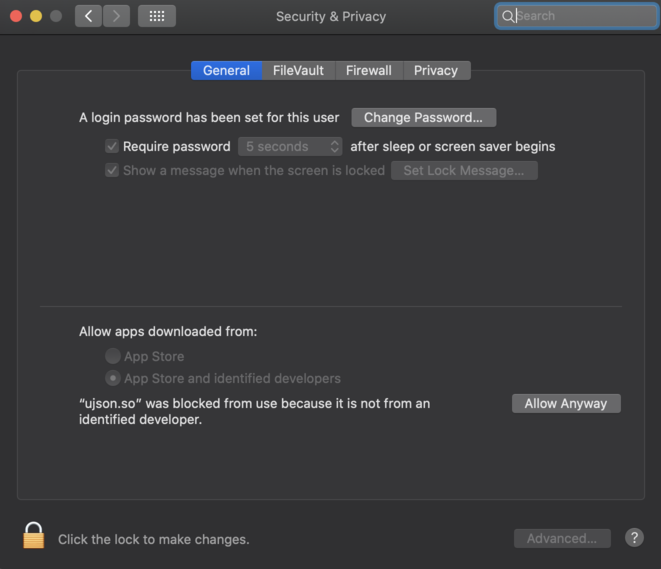

# What this does

This is a worflow for the Mac software "Alfred", which allows you to quickly (with a few keystrokes) find all your google docs. 

# Installation

You need to purchase the full version of Alfred to use workflows. If you don't have it, you should get it. It's well worth it.

Once you have Alfred full version (a.k.a. power pack):

1. Go to the [Releases](https://github.com/Decker87/gdrive-alfred/releases) page.
1. Find the latest release and download the `gdrive-alfred.alfredworkflow` file.
1. Once downloaded, find the `gdrive-alfred.alfredworkflow` file in Finder.
1. Double-click it.
1. Alfred should pop open to import the workflow. Click through the prompts.

# Usage

This workflow uses a magic keyword, `d`. Yes, just the letter d. Type "d" (lowercase) then a space then your search query.

You can also use the keyword `dp` to do the same thing, but paste the URL rather than open it.

The first time, you may need to wait for its cache to populate.

## Important note for OSX Catalina! Please read!

With OSX Catalina, Apple decided to break everything. Because of this you need to do an extra thing.

First, get the latest release of the Workflow: Click [here](https://github.com/Decker87/gdrive-alfred/releases).

After installing/updating and using the workflow for the first time, you might get a message saying that `ujson.so` can't be opened that looks like this:

1. To get past this, open up your Security & Privacy settings. You can find this by clicking the Apple logo in top-left, then select System Preferences.
1. You should see an option in there to allow access to `ujson.so`. Click to allow it. It should look like the screenshot below.

This is an open-source library for faster JSON manipulation. Apple decided with Catalina to by default block any apps that aren't from their app store, which is why it blocks this. It's perfectly safe.

# FAQs

??
